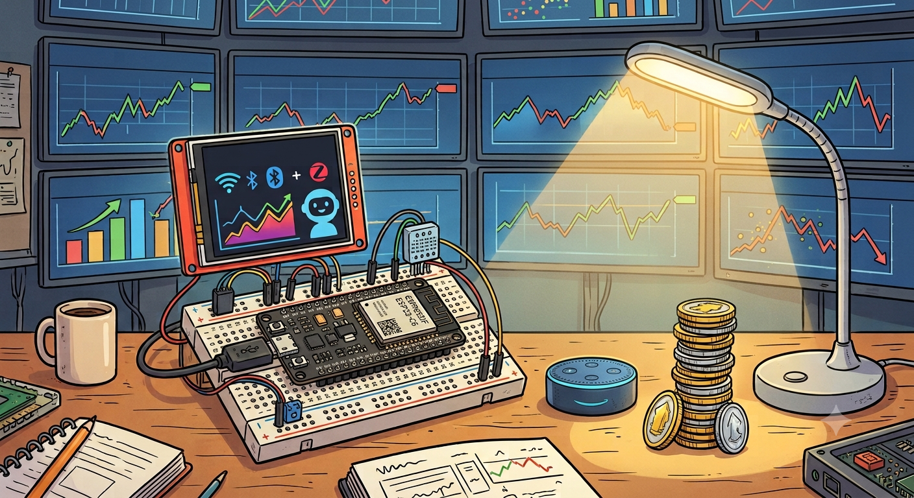

  

This project was born after Yahoo Finance discontinued its free API service for downloading market data into my spreadsheets.
  
Instead of switching to a paid service, I decided to build my own solution using PYTHON, free services and an ESP32 display.
  
Today it collects market data via web scraping, stores historical records in a SUPABASE PostgreSQL database, and updates JSON feeds on GITHUB — acting as the central data hub for the web dashboard, the ESP32 display, and spreadsheets. It also generates TELEGRAM reports and drives ALEXA notifications with SMART LIGHT control — all running on free-tier services.

  

  <strong>Developed on Raspberry Pi 400 | Hosted on Fly.io | Uptime: running since Dec 2025</strong>

  

<table align="center" cellspacing="0" cellpadding="0">
  <tr>
    <td>
      
    </td>
    <td>
      
    </td>
  </tr>
</table>

<!-- 
portfolio, finance, ETF, BTP, certificates, CSV, HTML, python, supabase, fly.io, github, raspberry, esp32, alexa, telegram, report, notification, alert, dashboard, web-scraping, sql, 3d printing, charts, iot, mutual funds, portfolio-tracker, spreadsheet, financial-dashboard, automated-web-scraping, portfolio-automation, personal-finance-tracker, personal-finance-dashboard, wealth-management, asset-allocation-tracker, stock-market-scraper, investing-automation, python-automation, serverless-scraping, free-tier-hosting, docker-microservice, smarthome-iot, esp32-display-case, esp32-financial-ticker, home-automation-trigger, alexa-smart-home, telegram-financial-bot, telegram-update-report, supabase-postgresql-integration, database-backup-automation, yahoo-finance-api-alternative, python-finance-script, telegram-investment-bot, alexa-home-automation, raspberry-pi-400-project, gunicorn-flask-deploy, fly-io-free-tier, automation-framework, btp-tracker, investment-tracking-system, realtime-market-data, smart-light-trigger, hardware-wallet-display, financial-ticker-iot
-->