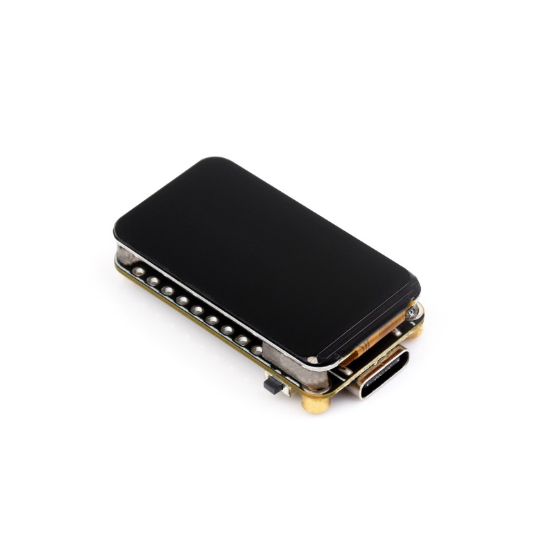
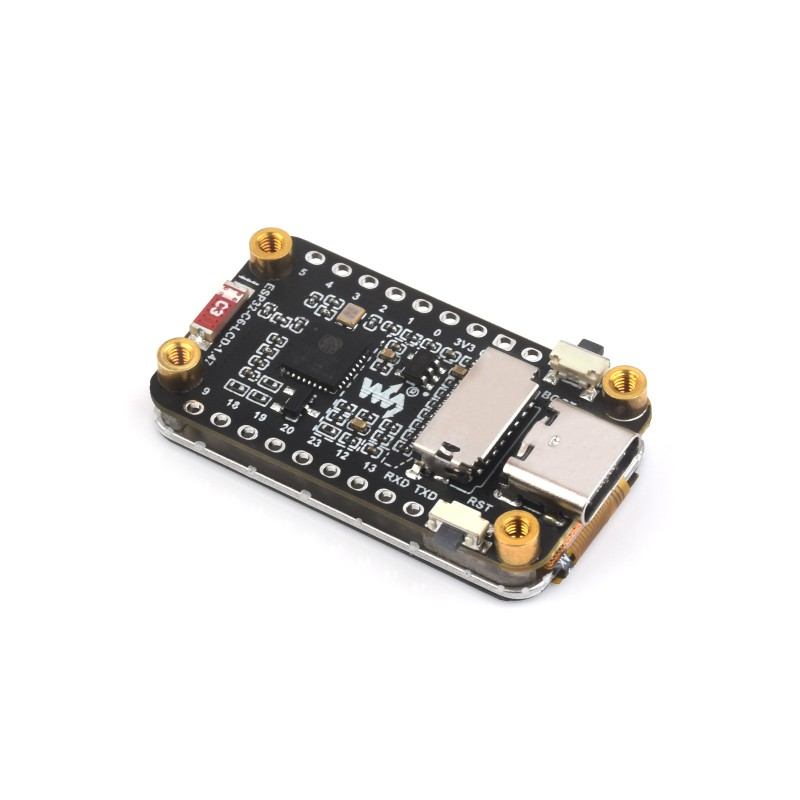
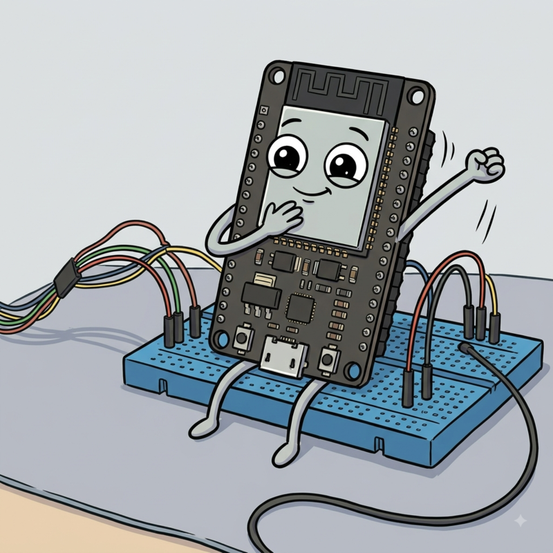
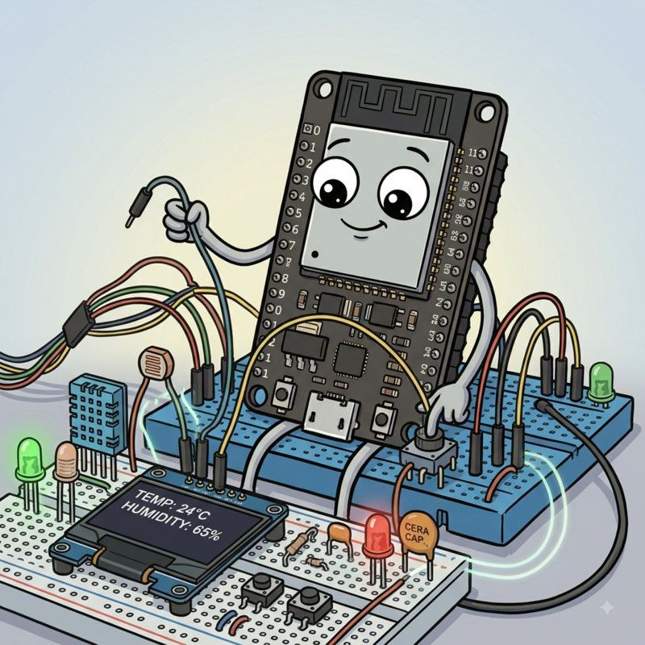
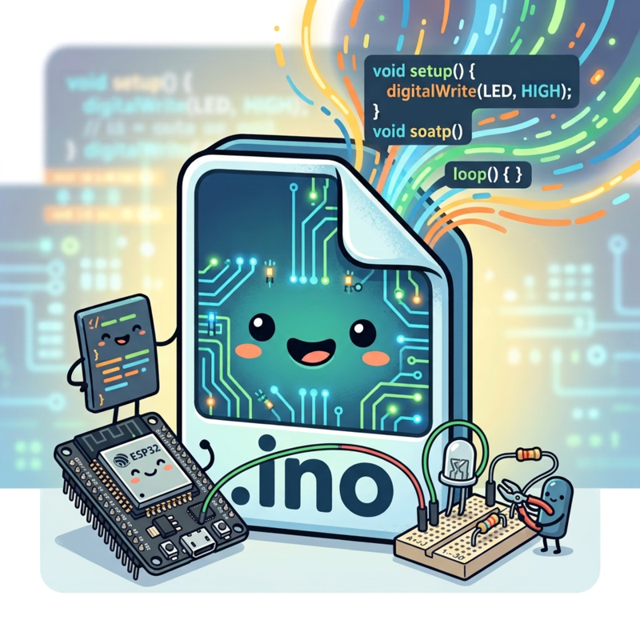

  

Firmware and 3D frame for my personal financial ticker
  
Built for the <strong>Waveshare ESP32-C6 LCD 1.47"</strong>

<table width="100%">
  <!-- ESP32-C6 -->
  <tr>
    <td width="50%" align="center">
      
      <b>front</b>
    </td>
    <td width="50%" align="center">
      
      <b>rear</b>
    </td>
  </tr>
 
</table>

For more information, check the official <strong>Waveshare product page</strong>

  

<table width="100%">
  <!-- Booting & Working -->
  <tr>
    <td width="50%" align="center">
       
      <a href="https://1drv.ms/v/c/2af802ae1015d527/IQBMCv45bPKxQ4iBKBVD3dlhAaqWxCWLC-DjPDl3iCRLWpI?e=Umt9kT" target="_blank">
        <b>▶ PLAY Booting Video... [watch until the end]</b>
      </a>
    </td>
    <td width="50%" align="center">
       
      <a href="https://1drv.ms/v/c/2af802ae1015d527/IQCNhCipOP6-Sp099fotOHFBAT1yOzM8O2MOebKPvtlrQGk?e=xRzW33" target="_blank">
        <b>▶ PLAY Working Video... [watch until the end]</b>
      </a>
       
      <i>ETF pages cycle automatically at 15-sec intervals</i>
    </td>
  </tr>
</table>

(Tip: use Ctrl+Click or Middle-Click to open VIDEO in a new tab)

  

  

  

DOWNLOAD

<table width="100%">
  <!-- DOWNLOAD  -->
  <tr>
    <td width="50%" align="center">
       
      <a href="../ESP32/DEMO.zip"><strong>Download Demo Firmware (.zip)</strong></a>
       
      <i>Includes: ETF.example.ino, config.example.h, market.example.json, language.example.h</i>
       
      <i>N.B.: rename them to: ETF.ino, config.h, market.json, language.h</i>
          </td>
    <td width="50%" align="center">
       
      <a href="../ESP32/frame.stl"><strong>Download 3D Frame (.stl)</strong></a>
       
      <i>3D PRINTED FRAME - LEGO TECHNIC STYLE</i>
       
      <i>100% compatible</i>
          </td>
  </tr>
 
</table>

  

<strong>Hardware & Materials</strong> 
<strong>3D Printer:</strong> Bambu Lab A1 / A1 Mini 
<strong>Filament:</strong> Silk PLA Plus 
<strong>Hardware Required:</strong> 4× M2 screws 
 
<strong>Slicer Settings</strong> 
<strong>Orientation:</strong> Face-down (front side flat on the build plate for the best surface finish) 
<strong>Layer Height:</strong> 0.20 mm 
<strong>Wall Loops (Perimeters):</strong> 4 or 5 (crucial for making the Technic hole walls 100% solid and durable) 
<strong>Infill:</strong> 30%-40% (Gyroid or Honeycomb) 
<strong>Supports:</strong> Yes (Tree / Auto - only needed for the internal ESP32 mounting tabs) 

<!-- 
portfolio, finance, ETF, BTP, certificates, CSV, HTML, python, supabase, fly.io, github, raspberry, esp32, alexa, telegram, report, notification, alert, dashboard, web-scraping, sql, 3d printing, charts, iot, mutual funds, portfolio-tracker, spreadsheet, financial-dashboard, automated-web-scraping, portfolio-automation, personal-finance-tracker, personal-finance-dashboard, wealth-management, asset-allocation-tracker, stock-market-scraper, investing-automation, python-automation, serverless-scraping, free-tier-hosting, docker-microservice, smarthome-iot, esp32-display-case, esp32-financial-ticker, home-automation-trigger, alexa-smart-home, telegram-financial-bot, telegram-update-report, supabase-postgresql-integration, database-backup-automation, yahoo-finance-api-alternative, python-finance-script, telegram-investment-bot, alexa-home-automation, raspberry-pi-400-project, gunicorn-flask-deploy, fly-io-free-tier, automation-framework, btp-tracker, investment-tracking-system, realtime-market-data, smart-light-trigger, hardware-wallet-display, financial-ticker-iot
-->