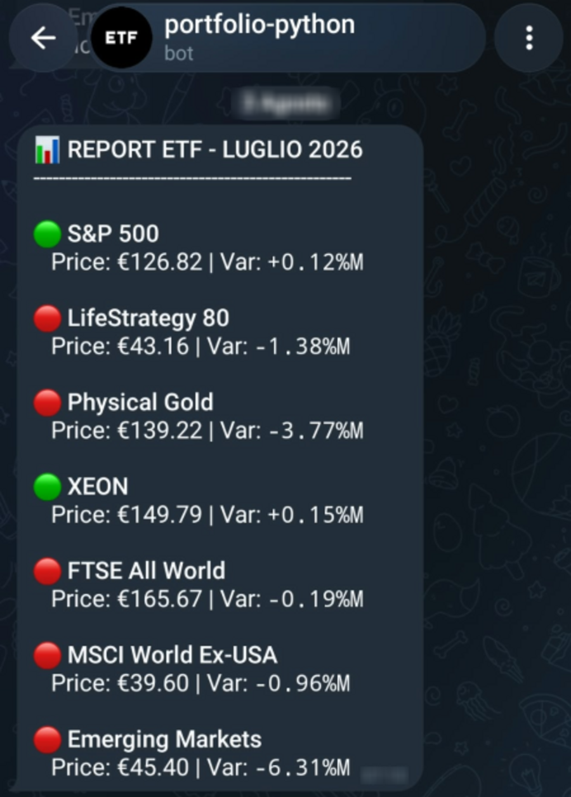
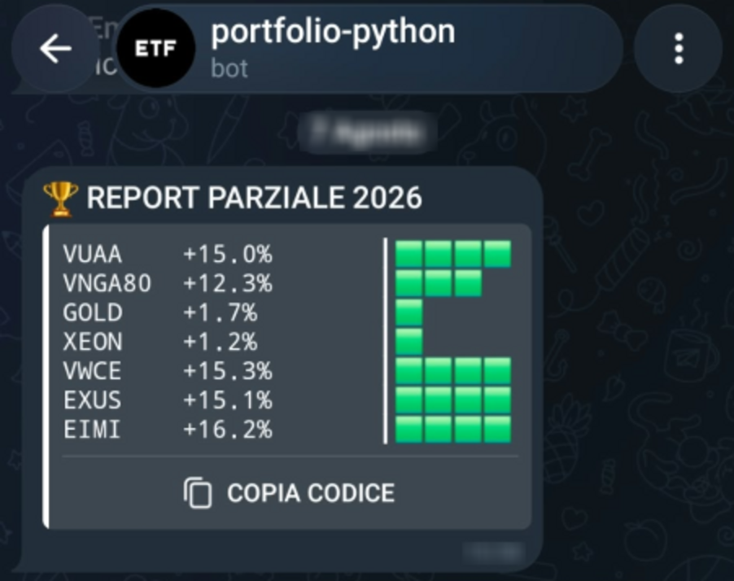
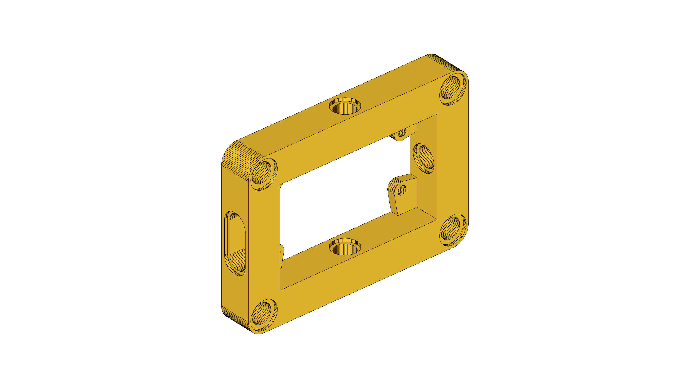
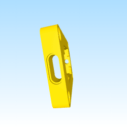

  

<table width="100%">
  <!-- Riga 1: Stato del Mercato -->
  <tr>
    <td width="50%" align="center">
       
      <b>📈 Market Status (Open)</b>
    </td>
    <td width="50%" align="center">
       
      <b>📉 Market Status (Closed)</b>
    </td>
  </tr>
  
  <!-- Riga 2: Grafici ed Elettronica -->
  <tr>
    <td width="50%" align="center">
       
      <b>📊 Historical Performance Charts</b>
    </td>
    <td width="50%" align="center">
       
      <b>📟 Coin Counter Ticker Display</b>
    </td>
  </tr>
  
  <!-- Riga 3: Reportistica Periodica -->
  <tr>
    <td width="50%" align="center">
       
      <b>📅 Monthly Investment Report</b>
    </td>
    <td width="50%" align="center">
       
      <b>🗓️ Annual Balance Report</b>
    </td>
  </tr>
  
  <!-- Riga 4: Hardware Realizzazione -->
  <tr>
    <td width="50%" align="center">
       
      <b>🔌 ESP32 Smart Case (Static)</b>
    </td>
    <td width="50%" align="center">
       
      <b>🔄 Hardware Device Update (Live GIF)</b>
    </td>
  </tr>
</table>

<!-- 
portfolio, finance, ETF, BTP, certificates, CSV, HTML, python, supabase, fly.io, github, raspberry, esp32, alexa, telegram, report, notification, alert, dashboard, web-scraping, sql, 3d printing, charts, iot, mutual funds, portfolio-tracker, spreadsheet, financial-dashboard, automated-web-scraping, portfolio-automation, personal-finance-tracker, personal-finance-dashboard, wealth-management, asset-allocation-tracker, stock-market-scraper, investing-automation, python-automation, serverless-scraping, free-tier-hosting, docker-microservice, smarthome-iot, esp32-display-case, esp32-financial-ticker, home-automation-trigger, alexa-smart-home, telegram-financial-bot, telegram-update-report, supabase-postgresql-integration, database-backup-automation, yahoo-finance-api-alternative, python-finance-script, telegram-investment-bot, alexa-home-automation, raspberry-pi-400-project, gunicorn-flask-deploy, fly-io-free-tier, automation-framework, btp-tracker, investment-tracking-system, realtime-market-data, smart-light-trigger, hardware-wallet-display, financial-ticker-iot
-->

