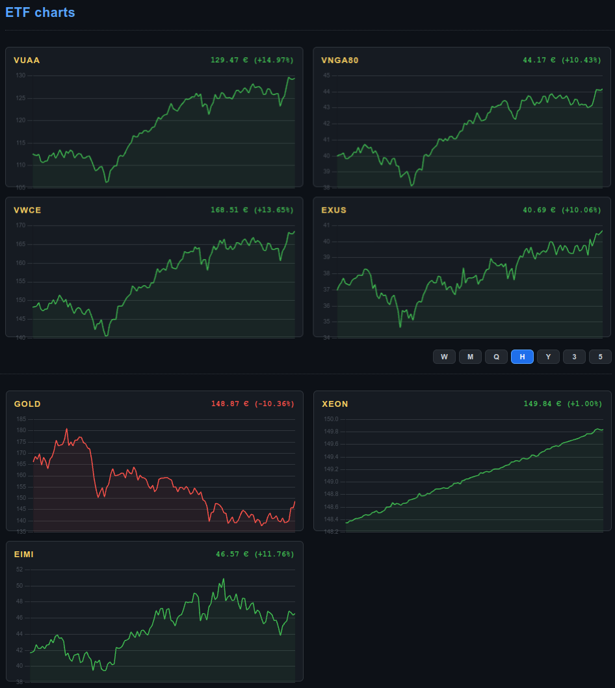
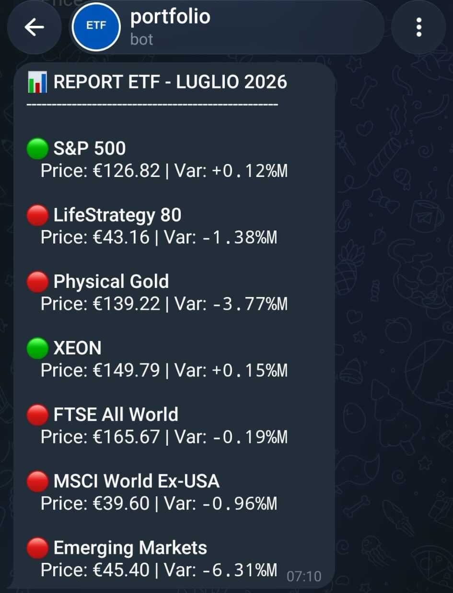
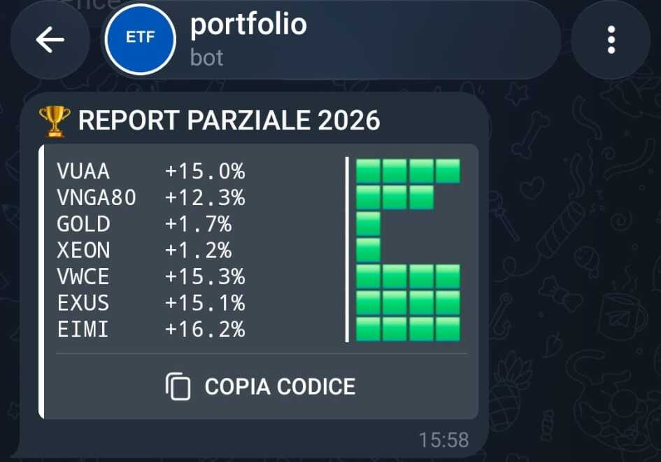
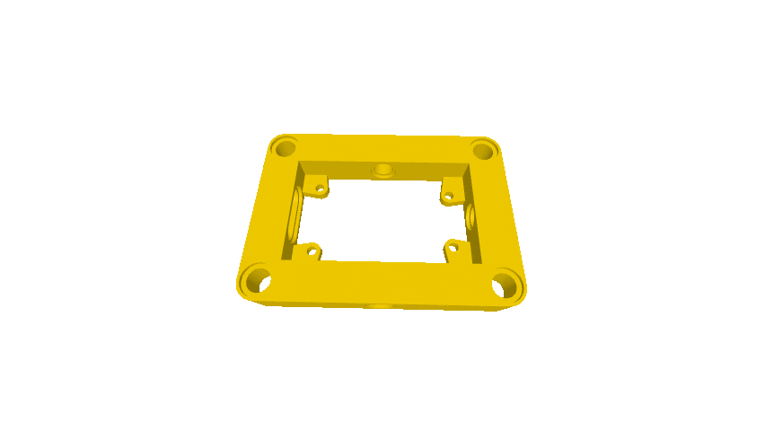

  

<table width="100%">
  <!-- MARKET live -->
  <tr>
    <td width="50%" align="center" valign="top">
       
      <b>MARKET live (open) - [web]</b>
    </td>
    <td width="50%" align="center" valign="top">
       
      <b>MARKET live (close) - [web]</b>
    </td>
  </tr>
  
  <!-- ESP32 live -->
  <tr>
    <td width="50%" align="center" valign="top">
       
      <b>MARKET live (open) - [ESP32-C6 1,47"]</b>
    </td>
    <td width="50%" align="center" valign="top">
       
      <b>MARKET live (close) - [ESP32-C6 1,47"]</b>
    </td>
  </tr>

  <!-- ESP32 & frame -->
  <tr>
    <td colspan="2" align="center" width="100%">
       
       
      <b>ESP32-C6 1,47" + frame</b>
        
    </td>
  </tr>

  <!-- ETF charts & coin counter -->
  <tr>
    <td width="50%" align="center" valign="top">
       
      <b>ETF charts [web]</b>
    </td>
    <td width="50%" align="center" valign="top">
       
      <b>coin counter [web]</b>
    </td>
  </tr>

  <!-- REPORTS -->
  <tr>
    <td width="50%" align="center" valign="top">
       
      <b>monthly REPORT [TELEGRAM]</b>
    </td>
    <td width="50%" align="center" valign="top">
       
      <b>annual REPORT [TELEGRAM]</b>
    </td>
  </tr>

  <!-- PROJECT -->
  <tr>
    <td colspan="2" align="center" width="100%">
       
       
      <b>ESP32-C6 1,47" + 3D frame LEGO TECHNIC style</b>
        
    </td>
  </tr>

  <!-- 3D FRAME -->
  <tr>
    <td width="50%" align="center" valign="top">
       
      <b>ESP32-C6 1,47" frame (static)</b>
    </td>
    <td width="50%" align="center" valign="top">
       
      <b>ESP32-C6 1,47" frame (animated)</b>
    </td>
  </tr>

  <!-- 3D PRINTING -->
  <tr>
    <td width="50%" align="center" valign="top">
       
      <b>3D frame print</b>
    </td>
    <td width="50%" align="center" valign="top">
       
      <b>3D frame mount</b>
    </td>
  </tr>
</table>

  

<table align="center" cellspacing="0" cellpadding="0">
  <tr>
    <td>
      
    </td>
    <td>
      
    </td>
  </tr>
</table>

<!-- 
portfolio, finance, ETF, BTP, certificates, CSV, HTML, python, supabase, fly.io, github, raspberry, esp32, alexa, telegram, report, notification, alert, dashboard, web-scraping, sql, 3d printing, charts, iot, mutual funds, portfolio-tracker, spreadsheet, financial-dashboard, automated-web-scraping, portfolio-automation, personal-finance-tracker, personal-finance-dashboard, wealth-management, asset-allocation-tracker, stock-market-scraper, investing-automation, python-automation, serverless-scraping, free-tier-hosting, docker-microservice, smarthome-iot, esp32-display-case, esp32-financial-ticker, home-automation-trigger, alexa-smart-home, telegram-financial-bot, telegram-update-report, supabase-postgresql-integration, database-backup-automation, yahoo-finance-api-alternative, python-finance-script, telegram-investment-bot, alexa-home-automation, raspberry-pi-400-project, gunicorn-flask-deploy, fly-io-free-tier, automation-framework, btp-tracker, investment-tracking-system, realtime-market-data, smart-light-trigger, hardware-wallet-display, financial-ticker-iot
-->